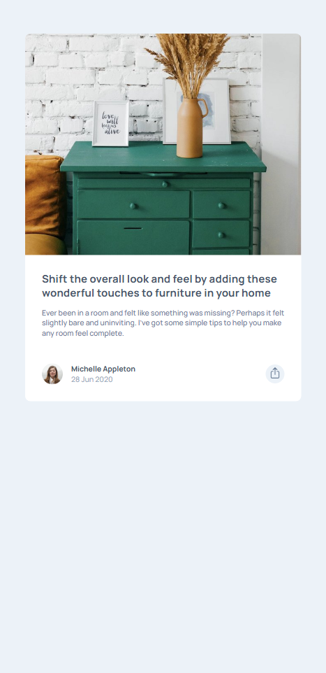
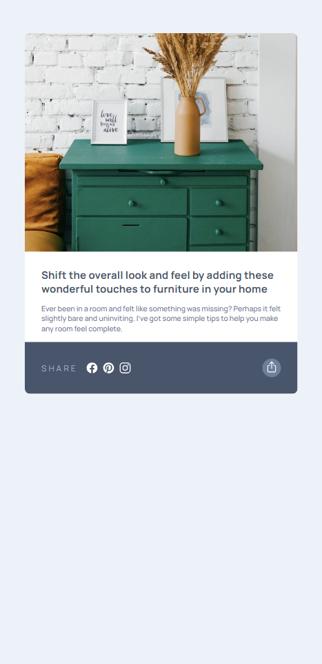
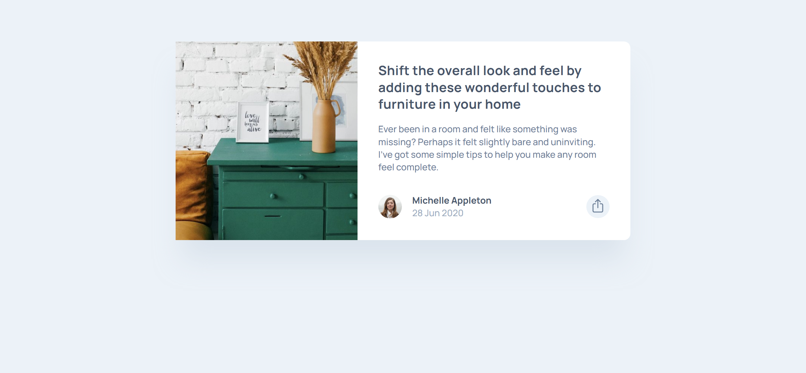
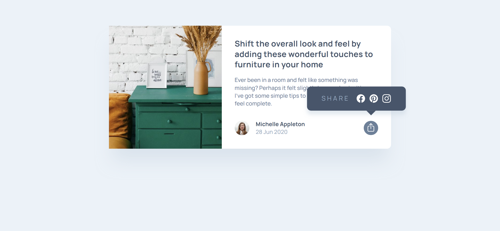

# Meet landing page solution

This is a solution to the [Meet landing page challenge on Frontend Mentor](https://www.frontendmentor.io/challenges/meet-landing-page-rbTDS6OUR). Frontend Mentor challenges help you improve your coding skills by building realistic projects.

## Table of contents

- [My process](#my-process)
  - [Built with](#built-with)
  - [Retrospection](#retrospection)
- [Overview](#overview)
  - [The challenge](#the-challenge)
  - [Screenshot](#screenshot)
  - [Links](#links)
  - [Useful resources](#useful-resources)
  - [AI Collaboration](#ai-collaboration)
- [Author](#author)

## My process

### Built with

- Semantic HTML5 markup
- CSS custom properties
- Flexbox
- Mobile-first workflow

### Retrospection

- Difficulties encountered?
  - How to make the footer element on hover take up the whole space.
  - How to add the styling for the mobile and desktop views ‘on click’ (JS part is easy)
    - I used a `share--open` class on the footer and then all the other elements that would change were added as children and prefixed with this `share--open` class as conditional styling. However, figuring out how to actually make the styling on hover was the difficult part. Learnt about creating triangles using borders though, very interesting.
- Mistakes
  - Had put align-items to center and the images kept sitting on center instead of using `object-fit: cover;` … couldn’t figure out the issue, until chatgpt pointed this out by accident after I had look for an hour and had taken a brake as well… So from now, whenever there is an issue, I think about _the assumptions → so this uses flexbox → how does flexbox work + what are the default values and what is the behavior for default values + have I changed those default values?_
  - I didn’t know how to add the styles for the mobile overlay efficiently → Fix: Used conditional styling showing the elements with a ‘conditional’ class added with JS on the parent class of all the elements that have to be styled.
  - How to make the footer element on hover take up the whole space.
    - This wasn’t possible since the card itself has padding all around the textbox.
    - **Fix: Use of negative margins to decrease the spacing and then use of padding to increase the space within the footer element itself so that the background colors takes the full bottom half.**
- Questions?
- What would you do better next time?
  - Give classes used for interactivity a clearer structure
- Learnings/takeaways
  - Creating a triangle using borders
  - Use of negative margin to occupy the space and afterwards take up the space as padding so that the space is within the element itself.

## Overview

### The challenge

Users should be able to:

- View the optimal layout for the component depending on their device's screen size
- See the social media share links when they click the share icon

### Screenshot

#### Mobile view

On click:

#### Dekstop view

On click:

### Links

- Solution URL: [Github repo](https://github.com/simeon2002/FEM-article-preview-component)
- Live Site URL: [Meet landing page](https://simeon2002.github.io/FEM-article-preview-component/)

### Useful resources

- MDN documentation

### AI Collaboration

ChatGPT helped me figure out that I had a mistake where I had my images centered with `align-items` instead of being stretched.

## Author

- Frontend Mentor - [@simeon2002](https://www.frontendmentor.io/profile/simeon2002)
- Twitter - [@SimeonSeraf1mov](https://x.com/SimeonSeraf1mov)
